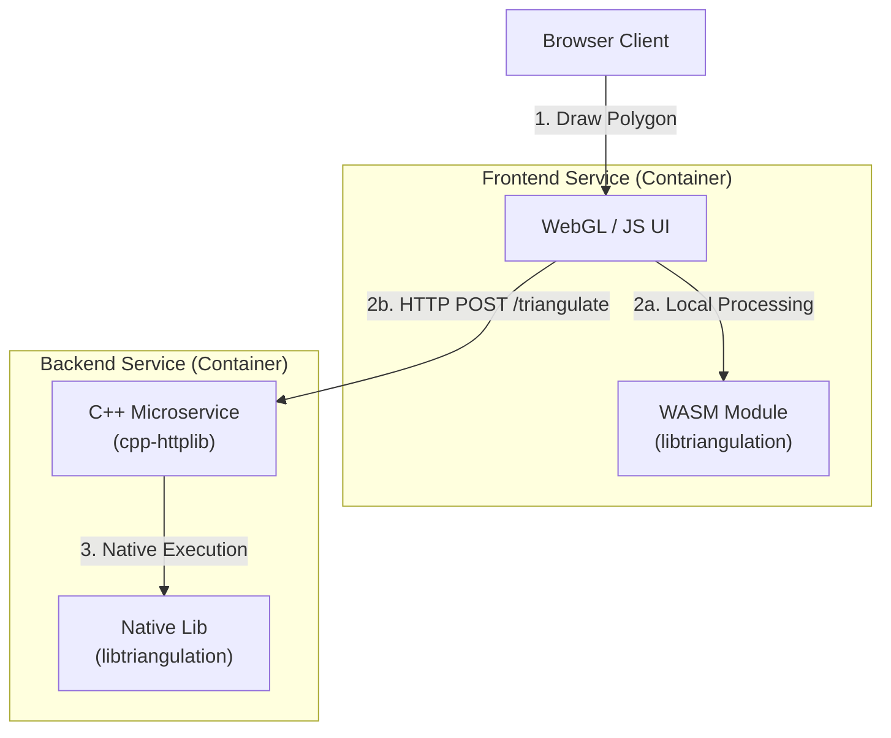

# 🔺 2D Polygon Triangulator (Hybrid C++/WASM)


**A high-performance geometric processing system demonstrating a hybrid architecture: REST API (C++ Microservice) and Client-side (WebAssembly).**

## 🚀 Engineering Highlights

This project demonstrates production-grade C++ development:

- **Hybrid Compute Architecture**: Seamlessly switches between **Server-side** (native C++ microservice) and **Client-side** (WASM) execution.
- **WebAssembly Optimization**: Shared C++ core library compiled with **Emscripten/embind** for zero-copy JS interop and offline capability.
- **High-Performance Algorithms**: Implements the ear-clipping algorithm (via `mapbox/earcut.hpp`) for O(n) triangulation.
- **Scalable Microservice**: Stateless API design using `cpp-httplib`, containerized with multi-stage Docker builds.
- **DevOps & Quality**: Automated testing via GoogleTest, structured logging (`spdlog`), and environment-based configuration.

## 🏗️ Architecture

The system shares a core C++ library (`libtriangulation`) between the backend API and the frontend WASM module.



## 🛠️ Tech Stack

| Component          | Technology                    | Role                                  |
| :----------------- | :---------------------------- | :------------------------------------ |
| **Backend**        | **C++17**, CMake, cpp-httplib | High-performance triangulation API    |
| **Frontend**       | WebGL, JavaScript (ES6)       | Interactive visualization & rendering |
| **Compute**        | **WebAssembly**, Emscripten   | Client-side heavy lifting             |
| **Algorithm**      | mapbox/earcut.hpp             | Efficient polygon processing          |
| **Infrastructure** | **Docker**, Docker Compose    | Containerization & orchestration      |
| **Testing**        | GoogleTest (GTest)            | Unit testing & verification           |

## ⚡ Quick Start

Run the entire system with one command. The build process automatically handles git submodules, WASM compilation, and container setup.

```bash
# Clone with recursive submodules
git clone --recursive <repository-url>
cd 2DPolygonTriangulator

# Build and start services
make build && make up
```

Access the application:

- **Frontend**: [http://localhost:3000](http://localhost:3000)
- **API Health**: [http://localhost:8080/health](http://localhost:8080/health)

## 🧪 Testing

Run unit tests in an isolated Docker environment:

```bash
make test
```

## 🎮 Features

1.  **Interactive Drawing**: Draw polygons directly on the HTML5 Canvas.
2.  **Dual Mode Processing**: Toggle between "Backend" (API) and "WASM" (Client) to compare performance.
3.  **Visual Feedback**: Real-time rendering of triangulated meshes.
4.  **File Import**: Upload JSON polygon definitions:

- Example:

```json
[
  [100, 100],
  [200, 100],
  [200, 200],
  [100, 200]
]
```

## 📄 License

This project is available under the MIT License.

---

**Author**: Jesús Izquierdo [Website](https://jesusizquierdo.dev) |
[LinkedIn](https://www.linkedin.com/in/jesus-izquierdo-cubas/) | [GitHub](https://github.com/jesusizq)
