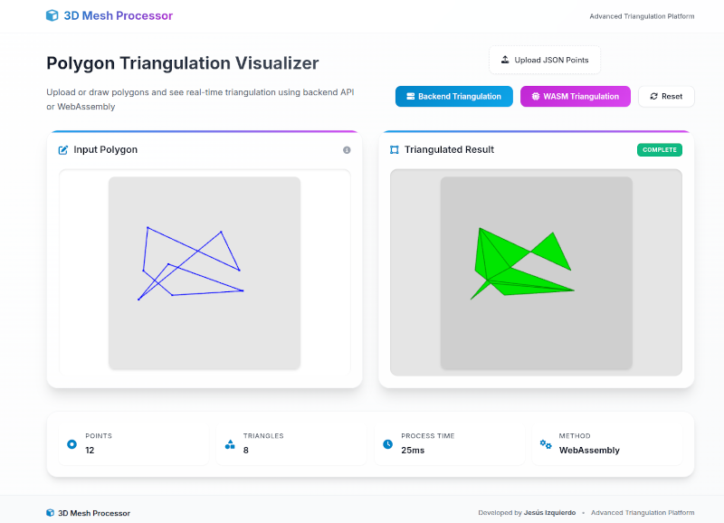
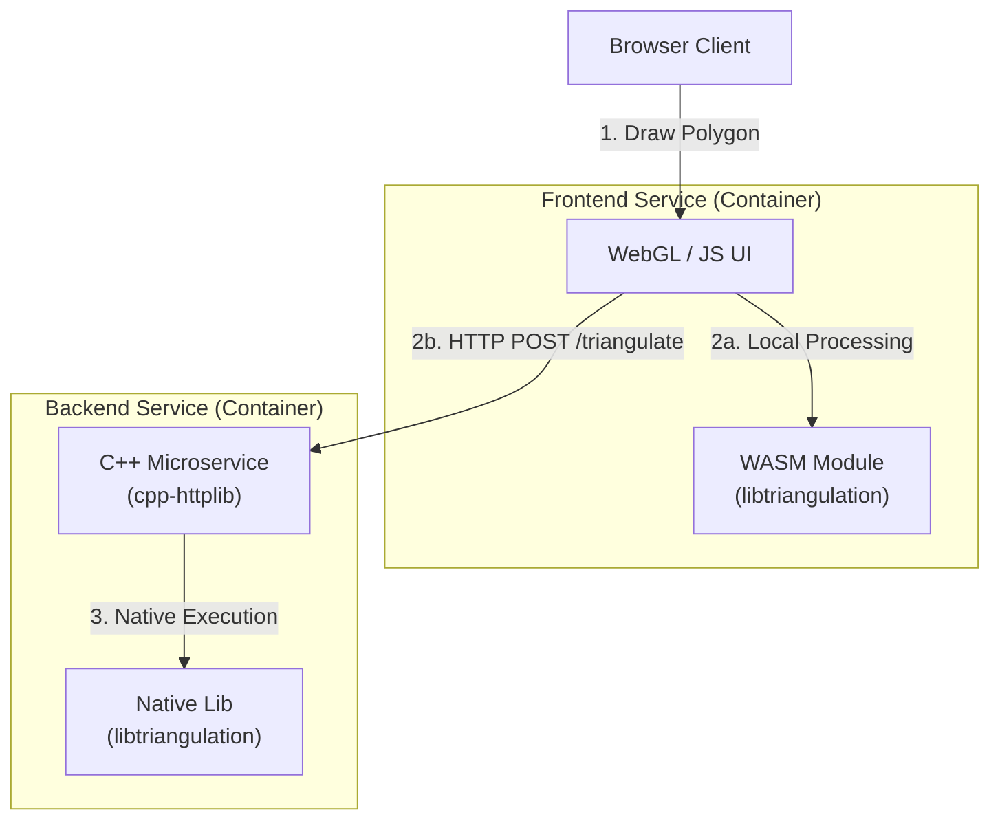

# 🔺 2D Polygon Triangulator (Hybrid C++/WASM)




**A high-performance geometric processing system demonstrating a hybrid architecture: REST API (C++ Microservice) and Client-side (WebAssembly).**

> **[🔥 See it live on my site!](https://triangulator.jesusizquierdo.dev)**

## 🚀 Engineering Highlights

This project demonstrates production-grade C++ development:

- **Hybrid Compute Architecture**: Seamlessly switches between **Server-side** (native C++ microservice) and **Client-side** (WASM) execution.
- **WebAssembly Optimization**: Shared C++ core library compiled with **Emscripten/embind** for zero-copy JS interop and offline capability.
- **High-Performance Algorithms**: Implements the ear-clipping algorithm (via `mapbox/earcut.hpp`) for O(n) triangulation.
- **Scalable Microservice**: Stateless API design using `cpp-httplib`, containerized with multi-stage Docker builds.
- **Production-Ready Gateway**: Cloud-native deployment architecture using **Caddy** for automatic SSL (HTTPS) and **Nginx** for optimized frontend delivery.
- **DevOps & Quality**: Automated testing via GoogleTest, network isolation via Docker networks, and environment-based configuration.

## 🏗️ Architecture

The system shares a core C++ library (`libtriangulation`) between the backend API and the frontend WASM module.


```mermaid
graph TD
    User[Browser Client]

    subgraph "Frontend Service (Container)"
        UI[WebGL / JS UI]
        WASM["WASM Module <br/> (libtriangulation)"]
    end

    subgraph "Backend Service (Container)"
        API["C++ Microservice <br/> (cpp-httplib)"]
        Core["Native Lib <br/> (libtriangulation)"]
    end

    User -->|1. Draw Polygon| UI
    UI -->|2a. Local Processing| WASM
    UI -->|2b. HTTP POST /triangulate| API
    API -->|3. Native Execution| Core
```

## 🛠️ Tech Stack

| Component          | Technology                    | Role                                  |
| :----------------- | :---------------------------- | :------------------------------------ |
| **Backend**        | **C++17**, CMake, cpp-httplib | High-performance triangulation API    |
| **Frontend**       | WebGL, JavaScript (ES6)       | Interactive visualization & rendering |
| **Compute**        | **WebAssembly**, Emscripten   | Client-side heavy lifting             |
| **Algorithm**      | mapbox/earcut.hpp             | Efficient polygon processing          |
| **Infrastructure** | **Docker**, Caddy, Nginx      | Containerization & Reverse Proxy      |
| **Testing**        | GoogleTest (GTest)            | Unit testing & verification           |

## 🔧 Prerequisites

Before running the project, ensure you have the following dependencies installed:

### Required Dependencies

- **Git** → For cloning repository and submodules
- **CMake** → Required by emcmake for WASM compilation
- **Node.js + npm** → For frontend JavaScript/WASM build process
- **Docker + Docker Compose** → For building and running containers
- **Emscripten SDK (emsdk)** → For compiling the triangulation library to WebAssembly. Install it following the [official guide](https://emscripten.org/docs/getting_started/downloads.html) or:

```bash
git clone https://github.com/emscripten-core/emsdk.git ~/emsdk
cd ~/emsdk
./emsdk install latest
./emsdk activate latest
echo "source ~/emsdk/emsdk_env.sh" >> ~/.bashrc
source ~/.bashrc
```

## ⚡ Quick Start

Run the entire system with one command. The build process automatically handles git submodules, WASM compilation, and container setup.

```bash
# Clone with recursive submodules
git clone --recursive <repository-url>
cd 2DPolygonTriangulator

# Build and start services (development profile)
make build && make up
```

For local development:

- **Frontend**: [http://localhost](http://localhost)
- **API Health**: [http://localhost/api/health](http://localhost/api/health)

### Choosing a profile

Every profile has its own `.env.<profile>` and publishes the gateway on a different address and port, so deploying with the wrong one fights whatever already owns those ports:

```bash
make up env=production            # or: ./docker/run.sh -d -e production up
```

A host that always deploys the same profile can pin it once in a git-ignored `.deploy-env` file at the repo root, and then drop the flag:

```bash
echo production > .deploy-env
```

`run.sh` prints the resolved profile, where it came from, and the ports the gateway is about to claim before starting anything.

Access the application (Production):

- **URL**: `https://your-domain.com` (Auto-SSL via Caddy)

> **Note on Local HTTPS**: When accessing via `https://localhost`, your browser will show a security warning. This is **expected** because Caddy generates a self-signed certificate for local development. In a production environment with a real domain, Caddy automatically provisions valid certificates via Let's Encrypt.

## 🧪 Testing

Run unit tests in an isolated Docker environment:

```bash
make test
```

## 🎮 Features

1.  **Interactive Drawing**: Draw polygons directly on the HTML5 Canvas.
2.  **Dual Mode Processing**: Toggle between "Backend" (API) and "WASM" (Client) to compare performance.
3.  **Visual Feedback**: Real-time rendering of triangulated meshes.
4.  **File Import**: Upload JSON polygon definitions:

- Example:

```json
[
  [100, 100],
  [200, 100],
  [200, 200],
  [100, 200]
]
```

## 📄 License

This project is available under the MIT License.

---

**Author**: Jesús Izquierdo [Website](https://jesusizquierdo.dev) |
[LinkedIn](https://www.linkedin.com/in/jesus-izquierdo-cubas/) | [GitHub](https://github.com/jesusizq)
